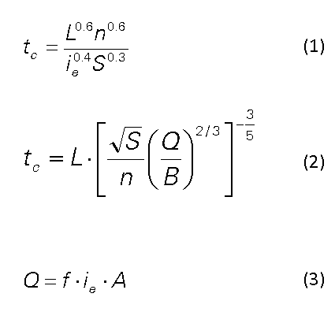
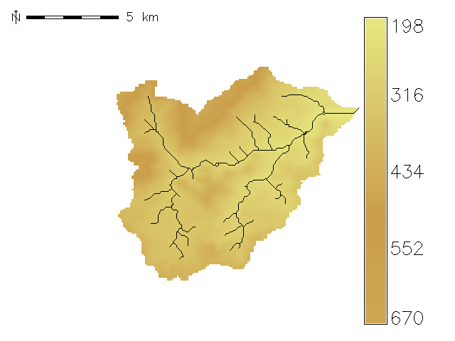
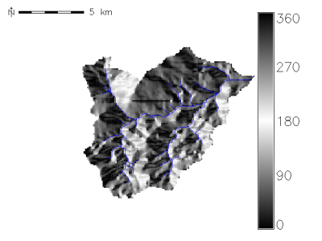
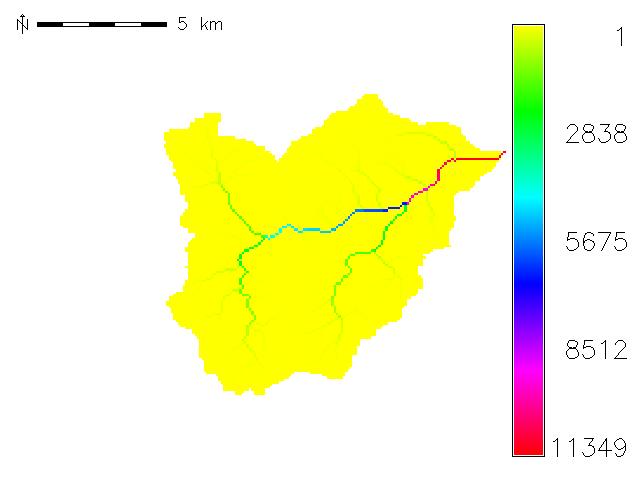
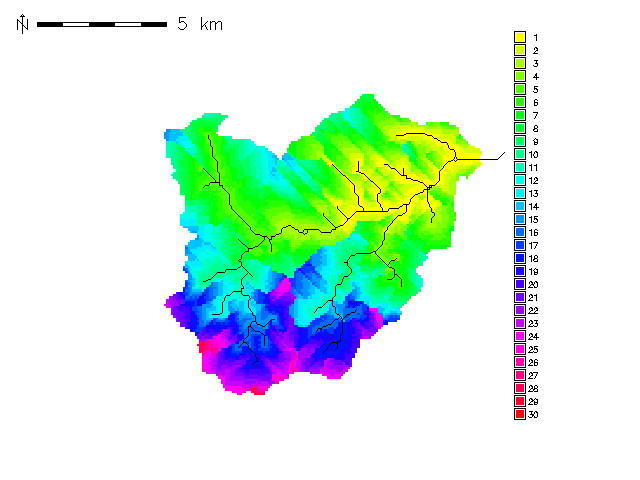
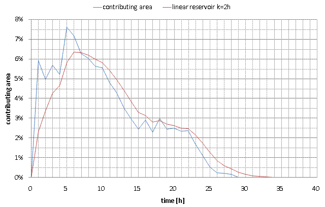

# r.traveltime

**GRASS GIS raster program by Kristian Förster**

**Original publication:** Saturday, 17 November 2007  
**Original source:** https://jesbergwetter.twoday.net/stories/4845555/

**Keywords:** GIS based travel time calculation / GIS-gestützte Fließzeitberechnung

> **Archival note:** This document preserves the technical article from the original webpage. The article text below is transcribed from the user-supplied Firefox HTML save and retains the original wording, spelling and punctuation. The blog sidebar, navigation, location map and other page furniture are intentionally omitted. The six supplied illustration files are retained locally in `images/` at the files supplied for this archive.

## Abstract

Setting up precipitation-runoff-models requires information about travel times on catchment scale. Using digital elevation data it is possible to estimate the area-traveltime function for lumped hydrologic models. This program is a simple way to estimate travel times with geographic information systems.

## Zusammenfassung

Für die Erstellung einfacher Niederschlag-Abfluss-Modelle werden Informationen über die Fließzeit im Einzugsgbiet benötigt. Für eine einfache Betrachtung dieser Prozesse mit einem Blockmodell kann mit Hilfe einer Flächen-Laufzeitfunktion eine Einheitsganglinie erstellt werden. Das hier vorgestellte Programm stellt eine einfache GIS-gestützte Möglichkeit der Ableitung der Fließzeiten dar.

## Theory

The algorithm starts computing at the basin outlet. The basin is processed recursively. For every cell the travel time to the basin outlet is given from values of the descending cell. The algorithm accounts even for surface runoff (1) and also channel flow (2). The user can define an minimum drainage area for computing channel flow. The kinematic wave formula is taken from Muzik (1996). This method was also used by Kilgore (1997) and Melesse and Graham (2004). In addition to former studies a correction factor is introduced because the calculation of flow velocities assumes an equilibrium discharge which accounts for a rainfall duration equal to or greater than the time of concentration. This assumption often results in channel flow velocities biased towards large values.

## Theorie

Der Algorithmus startet die Berechnung am Gebietsauslass und errechnet die Fließzeit rekursiv für das Gesamtgebiet. Es wird jeweils der Wert der unterhalbliegenden Rasterfläche berücksichtigt. Es wird sowohl der Landoberflächenabfluss (1) als auch der Gerinneabfluss (2) berechnet. Der Anwender kann eine Mindestgröße der Einzugsgebietsfläche festlegen, ab welcher Gerinneabfluss erfolgt. Der Berechnungsansatz nach der Theorie der kinematischen Welle wurde Muzik (1996) entnommen. Die dort beschriebene Methode wurde auch von Kilgore (1997) und Melesse und Graham (2004) verwendet. Anders als in den genannten Studien wird hier ein Korrekturfaktor eingesetzt. Dieser dient zur Berücksichtigung von Ereignissen welche kürzer als die Konzentrationszeit sind. Damit lässt sich die Überschätzung der Fließgeschwindigkeiten im Fließgewässer, wie sie im ursprünglichen Ansatz bestand, korrigieren.

### Original equations

### LaTeX transcription

The equations shown in the original image can be transcribed as follows. The original GIF above is retained as the authoritative historical representation.

$$
t_c = \frac{L^{0.6} n^{0.6}}{i_e^{0.4} S^{0.3}}
\tag{1}
$$

$$
t_c =
L \cdot
\left[
\frac{\sqrt{S}}{n}
\left(\frac{Q}{B}\right)^{2/3}
\right]^{-3/5}
\tag{2}
$$

$$
Q = f \cdot i_e \cdot A
\tag{3}
$$

### Variables

| Symbol | English | Deutsch |
|---|---|---|
| $t_c$ | travel time | Fließzeit |
| $L$ | length | Fließlänge |
| $n$ | Manning's roughness coefficient | Rauhigkeitsbeiwert nach Manning |
| $i_e$ | excess precipitation | Effektivniederschlag |
| $S$ | slope | Hangneigung / Gefälle |
| $Q$ | equilibrium discharge | Gleichgewichtsabfluss |
| $B$ | channel width | Gerinnebreite |
| $f$ | reduction factor to account for overestimation of flow velocities in channels | Korrekturfaktor zur Berücksichtigung der Überschätzung der Fließgeschwindigkeit im Fließgewässer |
| $A$ | contributing area | Einzugsgebietsfläche |

## Results and discussion

The following maps show input and output datasets for a small watershed (92 km²) based on the SRTM dataset (90 m resolution). Manning's roughness is assumed to be 0.1 (not shown) for surface runoff and 0.029 for channel runoff (f=0.2). The threshold value for channel flow is 100 cells = 0,8 km² (Estimation).  
The travel times are smallest in the valleys and on the steep hillsides in the north of study area. The resulting travel times (0 to 1 day) are within the realms of possibility.

## Ergebnisse und Diskussion

Die folgenden Abbildungen zeigen die Ein- und Ausgaben des Programms für ein ca 92 km² großes Einzugsgebiet. Es wurden SRTM Daten mit 90 m Auflösung gewählt. Die Geländerauhigkeit wurde mit 0,1 für den Oberflächen- und 0,029 für den Gerinneabfluss (f=0,2) geschätzt. Der Grenzwert für den Gerinneabfluss wurde ebenfalls geschätzt. Es wurden 100 Rasterflächen bzw. 0,8 km² angenommen.  
Deutlich erkennbar sind die geringeren Fließzeiten in Tälern und im steilen Gelände im Norden des Untersuchungsgebietes. Die Ergebnisse (Fließzeiten von 0 bis 1 Tag) erscheinen plausibel.

### Figures

#### 1. Digital Terrain Model [meters] / Digitales Geländemodell [m+NN]

#### 2. Flow Direction [degrees counterclockwise from east] / Fließrichtung [Grad Gegenuhrzeigersinn von Osten]

#### 3. Accumulation Grid [number of cells] / Einzusgebietsgröße [Anzahl von Elementen]

#### 4. Results: travel time in hours (10 mm/h excess precipitation) / Ergebnis: Fließzeit in Stunden (10 mm/h Effektivniederschlag)

#### 5. Results: contributing area versus time / Ergebnis: Flächenlaufzeitfunktion

## Outlook

The presented algorithm has been tested for one basin. Further testing and detailed evaluation is needed to conclude on which scales the program works best.

## Ausblick

Der Algorithmus wurde nur für ein Einzugsgebiet getestet. Weitere Beispiele müssen geprüft werden und es sind detaillierte Auswertungen erforderlich um den gültigen Skalenbereich der Anwendung besser einschätzen zu können.

## References / Quellenangaben

Kilgore, J. L. (1997): *Development and evaluation of a GIS-based spatially distributed unit hydrograph model*, master thesis, Virginia Polytechnic Institute and State University

Melesse, A. M., Graham, W. D. (2004): *Storm runoff predicition based on a spatially distributed travel time method utilizing remote sensing and GIS*, Journal of the American Water Resources Association, 8, 863-879

Muzik, I. (1996): *Flood modelling with GIS-derived distributed unit hydrographs*, Hydrological Processes, 10, 1401-1409

## Download and update

The original page provided a download link for `r.traveltime.tar.gz` and linked to a subsequent update:

- Download: `r.traveltime.tar.gz`
- Update: **changed parameters** — https://jesbergwetter.twoday.net/stories/4955888/

The software download itself is not included in this documentation-only preservation copy.

## Original publication note

You are invited to test, share and improve the software under terms of GNU General Public License (GPL). Please let me know if you find any bugs.

---

# Update: changed parameters

**28 May 2008**

Original source: https://jesbergwetter.twoday.net/stories/4955888/

The estimation of the fdis factor for scaling the excess precipitation  is not trivial because there aren't any comparative values available.  I've concluded that this calculations are not suitable for flood  modeling. The input values "Excess precipitation" and "fdis" are  replaced by the mean specific discharge of floods. The value can be  obtained by statistical evaluation of observations. Moreover you can  assume that this value is also valid for unobserved basins in the  vicinity (200 l/s/km**2 is a good guess for mid latitude basins, maybe  higher in mountainous basins).
